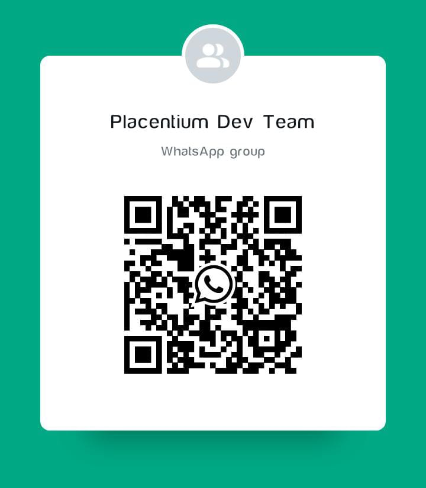

# Placentium - A Decentralized File System Blockchain 🌐

## 🌟 Overview

- **Decentralized File System**: A blockchain-powered solution for **distributed file storage** without reliance on centralized servers.
- **Proof-of-Storage Model**: Nodes are **rewarded** for contributing storage space, making hosting and storage cost-effective.
- **Immutable & Redundant**: Data is **split into chunks, encrypted, and distributed** across multiple nodes through the **DataLattice** for fault tolerance and security.
- **Placentium Web - Decentralized Hosting**: A specialized layer built on Placentium that enables **web hosting on the blockchain**, ensuring censorship resistance and cost efficiency.
- **Placentium Coin (PLC)**: The native token used for storage payments, hosting fees, and incentivizing network participation.

## 🔍 How It Works

### DataLattice: The Future of Decentralized Storage
- **On-Chain Metadata, Off-Chain Storage**: The blockchain stores **metadata**, including file hashes, ownership records, and storage locations, while the actual file chunks are stored across **storage nodes**.
- **Data Redundancy & Fault Tolerance**: Files are split into **encrypted chunks**, stored across multiple nodes, and validated using cryptographic **hashing and Merkle trees**.
- **Security & Privacy**: Unlike centralized storage providers, **users retain control over their data**, reducing risks of censorship, data breaches, and unauthorized access.
- **Incentivized Network**: Storage providers **earn PLC tokens** for storing and maintaining file availability, making participation in the network economically sustainable.

### Placentium Web: Decentralized Hosting
- **Hosting Nodes**: Special nodes store website-related data and provide **content delivery**, ensuring efficient access to hosted websites.
- **Immutable Website Storage**: Websites stored on the blockchain are **resistant to takedowns and censorship**, ensuring continuous availability.
- **Cost-Effective Alternative**: Eliminates the need for expensive hosting services by distributing website storage across the network.

## 🔗 Node Types & Rewards

- **Storage Nodes**: Contribute disk space to store file chunks and metadata. Rewarded with **PLC tokens** based on uptime, availability, and storage contribution.
- **Hosting Nodes**: Serve website content stored on Placentium Web. Rewarded through **microtransactions in PLC** for delivering content efficiently.
- **Validator Nodes**: Maintain blockchain integrity by verifying transactions and storage claims. Earn **transaction fees and staking rewards**.

## 🛣 Roadmap

📌 **Phase 1: Core Blockchain & P2P System**
- Develop a blockchain with **Proof-of-Work (PoW) consensus** and decentralized P2P networking
- Implement a **command-line interface (CLI) and terminal UI (TUI)** for blockchain interaction

📌 **Phase 2: Web UI & API**
- Design a **web-based blockchain explorer** for real-time network monitoring
- Develop **RESTful APIs** to facilitate programmatic interaction with the blockchain

📌 **Phase 3: Decentralized File System (DFS)**
- Engineer a **distributed file storage protocol** utilizing **data chunking, hashing, and redundancy mechanisms**
- Implement **storage validation techniques** to ensure data integrity and accessibility

📌 **Phase 4: Tokenization & Rewards**
- Introduce **Placentium Coin (PLC)** as the foundation for network transactions
- Deploy **smart contracts** to facilitate automated storage payments, staking, and node rewards

📌 **Phase 5: DataLattice - Decentralized Hosting**
- Develop infrastructure for **website hosting on the blockchain**
- Optimize content delivery mechanisms for seamless access to hosted sites

📌 **Phase 6: Public Launch & Adoption**
- Deploy **mainnet version** of Placentium for real-world use
- Expand developer ecosystem and onboard **early adopters and enterprise clients**

## 🤝 Join the Development 🚀

We are looking for **developers, blockchain researchers, and UI/UX designers** to contribute to **Placentium**! If you're interested in building the future of decentralized storage, reach out through **GitHub Issues** or join our community.

💬 **WhatsApp Group** : [Join here](https://chat.whatsapp.com/Cd00XYSLIXKAGDtZuwlOQH)

📞 **Phone Number**: +91 91506 91374

📂 **GitHub Repo**: [Link](https://github.com/KashyapKrishnaJ/Placentium)

---

## 📜 License

📝 **GNU General Public License** : [LICENSE](LICENSE)
